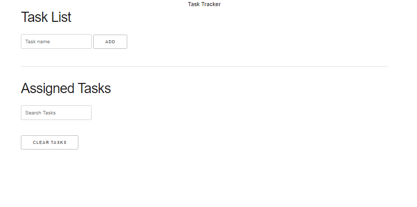
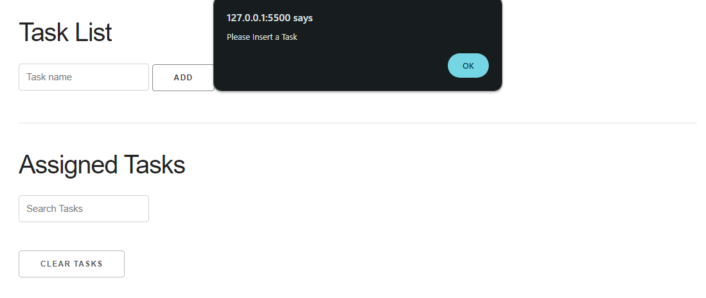
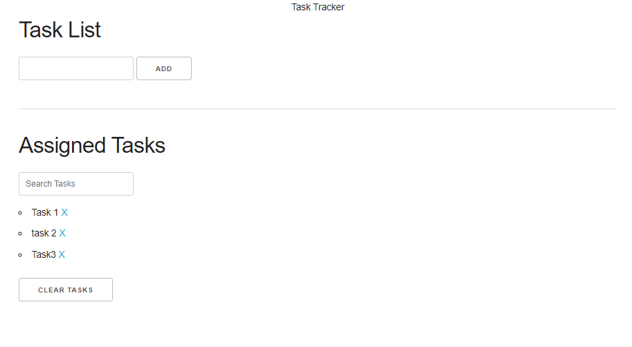
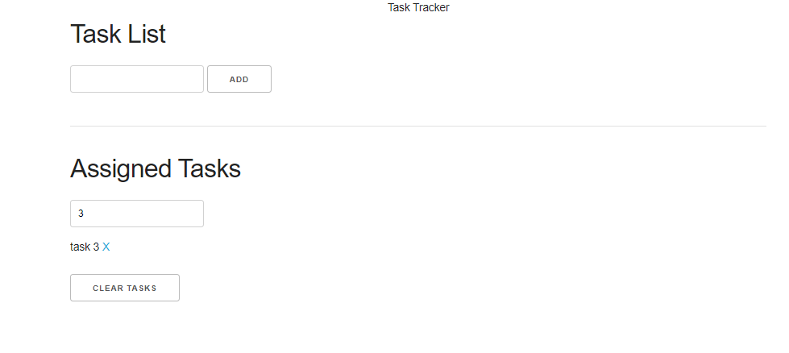
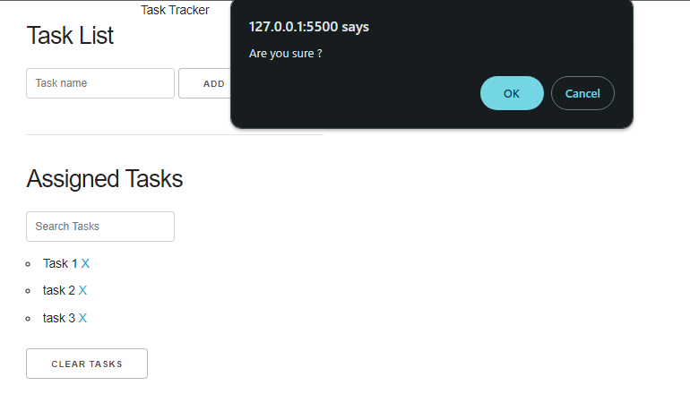
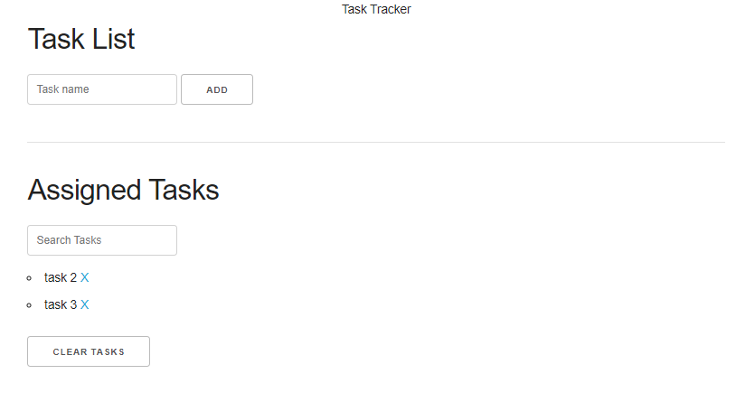
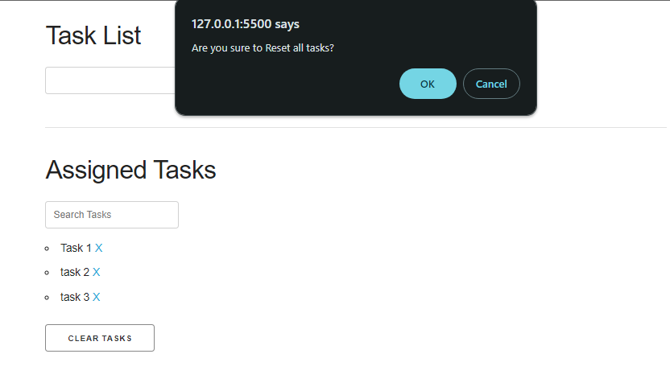
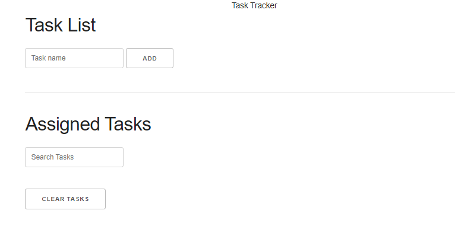

## Task Tracker 📝
A simple task management tool where task addition, filtering out and deletion can be done by a click!

### Screenshots

<ol>
  <li>Home Page  
    
  </li>
  <li>When empty input is given, alerts  
    
  </li>
  <li>Task Addition  
    
  </li>
  <li>Search tasks  
    
  </li>
  <li>Delete individual task by pressing (X)  
    
  </li>
  <li>Task List after deletion  
    
  </li>
  <li>Reset all tasks  
    
  </li>
  <li>After reset (empty)  
    
  </li>
</ol>

